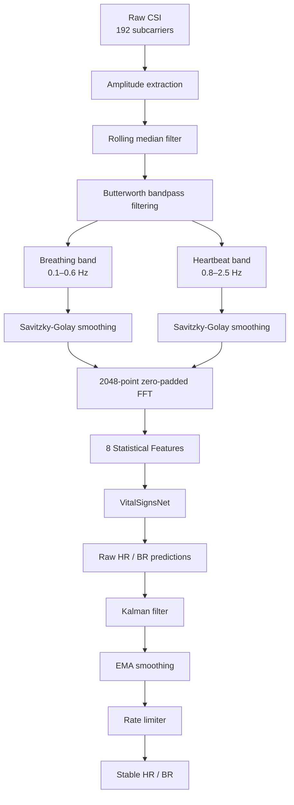

# WeeCare AI

<p align="center">
  <strong>Contactless Elderly Vital-Sign & Sleep Monitoring with Wi-Fi CSI + Deep Learning</strong><br>
  <em>Sense breathing, heartbeat, sleep, and room activity without wearable sensors or cameras.</em>
</p>

<p align="center">
  
  
  
  
  
</p>

---

## Table of Contents

- [Overview](#overview)
- [Problem Statement](#problem-statement)
- [Solution](#solution)
- [How Wi-Fi CSI Sensing Works](#how-wi-fi-csi-sensing-works)
- [Key Features](#key-features)
- [System Architecture](#system-architecture)
- [Signal Processing Pipeline](#signal-processing-pipeline)
- [Technology Stack](#technology-stack)
- [Hardware Cost](#hardware-cost)
- [Installation & Setup](#installation--setup)
- [Usage](#usage)
- [Dashboard Indicator Legend](#dashboard-indicator-legend)
- [Benefits](#benefits)
- [Future Scope](#future-scope)
- [Project Structure](#project-structure)
- [Team](#team)
- [License](#license)

---

## Overview

**WeeCare AI** is a contactless elderly vital-sign and sleep-monitoring system built around **Wi-Fi Channel State Information (CSI)** and deep learning.

Instead of attaching sensors to a person, WeeCare uses two low-cost **ESP32 DevKit v3** boards placed in a room:

- **TX node:** continuously transmits a 2.4 GHz Wi-Fi signal.
- **RX node:** receives the signal and captures CSI across **192 subcarriers**.
- **Python backend:** receives raw CSI over USB serial at **921600 baud**.
- **DSP pipeline:** separates breathing- and heartbeat-related signal components.
- **VitalSignsNet:** estimates heart rate and breathing rate.
- **Stabilization layer:** reduces jitter and produces smoother real-time measurements.
- **Dashboard:** streams the results live over WebSocket at **20 FPS**.

The goal is to make continuous monitoring more accessible for elderly individuals while reducing dependence on wearables, cameras, bed mats, and frequent manual checks.

> **Current status:** Core contactless vital-sign monitoring, sleep visualization, restlessness monitoring, alerts, and live dashboard are implemented. Fall detection, intruder detection, and multi-person tracking are roadmap modules and are **not yet built**.

---

## Problem Statement

Elderly people who live alone or require continuous supervision can experience health or safety events between scheduled check-ins. Conventional monitoring approaches often require the person to actively wear, carry, or interact with a device.

### Why existing approaches can fall short

| Approach | Limitation |
|---|---|
| **Wearables** | Must be worn and charged; may be removed during sleep; can be uncomfortable or forgotten. |
| **Cameras** | Raise privacy concerns, especially in bedrooms and personal spaces; require line of sight and adequate lighting. |
| **Bed mats / pressure sensors** | Detect presence or movement at a specific location but do not directly provide a room-wide contactless sensing modality. |
| **Nurse / caregiver check-ins** | Human checks are valuable but periodic rather than continuous and cannot observe every event between visits. |
| **Dedicated medical hardware** | Can be accurate but may increase installation cost, maintenance burden, and complexity. |

WeeCare addresses this gap with a low-cost sensing approach that uses a signal already present in the room: **Wi-Fi**.

> **Important:** WeeCare AI is a research/prototype monitoring system, not a medical device. Its measurements and alerts should not be treated as a replacement for professional medical equipment or clinical judgment.

---

## Solution

WeeCare turns small changes in Wi-Fi propagation into physiological measurements.

A person standing, sitting, or sleeping between the ESP32 nodes slightly changes the wireless channel. Tiny chest movements caused by breathing and cardiac activity alter the amplitude and phase of the received CSI.

The system processes these changes to estimate:

- ❤️ Heart rate
- 🫁 Breathing rate
- 😴 Sleep stage
- 🛌 Restlessness
- 🚨 Abnormal-condition alerts
- 📡 ESP32 connection status

### End-to-end concept

```text
                 Human in the room
                        │
                        │ Chest movement
                        ▼
┌────────────────┐   Wi-Fi CSI   ┌────────────────┐
│ ESP32 TX       │ ─────────────►│ ESP32 RX       │
│ 2.4 GHz signal │               │ 192 subcarriers│
└────────────────┘               └───────┬────────┘
                                         │
                                         │ Raw CSI
                                         │ USB / 921600 baud
                                         ▼
                              ┌─────────────────────┐
                              │ Python Backend      │
                              │ FastAPI + PyTorch   │
                              └──────────┬──────────┘
                                         │
                                         ▼
                              ┌─────────────────────┐
                              │ DSP + Feature       │
                              │ Extraction          │
                              └──────────┬──────────┘
                                         │
                                         ▼
                              ┌─────────────────────┐
                              │ VitalSignsNet       │
                              │ HR + Breathing Rate │
                              └──────────┬──────────┘
                                         │
                                         ▼
                              ┌─────────────────────┐
                              │ Stabilization       │
                              │ Kalman → EMA →      │
                              │ Rate Limiter        │
                              └──────────┬──────────┘
                                         │
                              ┌──────────┴──────────┐
                              │                     │
                              ▼                     ▼
                       Alert Engine          WebSocket 20 FPS
                                                    │
                                                    ▼
                                             Live Dashboard
```

---

## How Wi-Fi CSI Sensing Works

**Channel State Information (CSI)** describes how a wireless signal changes while travelling between a transmitter and receiver.

The received CSI contains information about the wireless channel over multiple OFDM subcarriers. When a human body moves—even by a very small amount—the propagation paths and reflections change.

For WeeCare:

1. The **TX ESP32** continuously transmits a 2.4 GHz Wi-Fi signal.
2. The **RX ESP32** captures CSI from the received signal.
3. CSI is collected across **192 subcarriers**.
4. The system derives an amplitude representation from the CSI.
5. Physiological motion is isolated using digital signal processing.
6. The breathing and heartbeat frequency bands are analyzed.
7. Statistical features are extracted from the processed signal.
8. **VitalSignsNet** predicts heart rate and breathing rate.
9. Temporal stabilization reduces sudden prediction jumps.
10. Results are streamed to the dashboard.

### Physiological frequency bands

| Signal | Approximate frequency band |
|---|---:|
| Breathing | **0.1–0.6 Hz** |
| Heartbeat | **0.8–2.5 Hz** |

These correspond approximately to:

- Breathing: **6–36 RPM**
- Heart rate: **48–150 BPM**

The bands are processing ranges rather than clinical validity guarantees.

---

## Key Features

### ❤️ Contactless Vital Monitoring

Estimates:

- Heart rate
- Breathing rate

without requiring a wearable sensor attached to the subject.

### 😴 Sleep Monitoring

The dashboard presents a sleep hypnogram with:

- Awake
- Light
- Deep
- REM

### 📈 Real-Time Visualization

Results stream over **WebSocket at 20 FPS** to a dark-themed browser dashboard using HTML, CSS, JavaScript, and Chart.js.

### 🧘 Restlessness Monitoring

Movement-related changes are used to provide a restlessness score for observing sleep activity.

### 🚨 Real-Time Alerts

Current alert conditions include:

- **Sleep apnea:** breathing rate < 6 RPM during sleep
- **Cardiac emergency:** HR > 120 BPM or HR < 40 BPM
- **Night wandering:** out of bed for > 15 minutes
- **ESP32 disconnection**

### 💰 Ultra-Low Hardware Cost

The prototype can be built with approximately **$7** of core hardware:

- 2 × ESP32 DevKit v3
- USB cable(s)

### 🔒 Contactless Architecture

The sensing concept does not require:

- A camera pointed at the person
- A wearable on the person
- A pressure mat under the mattress

---

# System Architecture

```mermaid
flowchart LR
    A["ESP32 TX<br/>2.4 GHz Wi-Fi"] -->|Wireless signal| B["Human / Room<br/>Propagation Changes"]
    B --> C["ESP32 RX<br/>192 CSI Subcarriers"]
    C -->|Raw CSI<br/>USB Serial 921600| D["FastAPI Backend"]

    D --> E["DSP Pipeline"]
    E --> E1["Rolling Median Filter"]
    E1 --> E2["Butterworth Bandpass"]
    E2 --> E3["Breathing / Heartbeat Split"]
    E3 --> E4["Savitzky-Golay Smoothing"]
    E4 --> E5["2048-point Zero-Padded FFT"]
    E5 --> F["8-D Feature Vector"]

    F --> G["VitalSignsNet<br/>BatchNorm1d(8) → 64 → 128 → 64"]
    G --> H["HR Head + BR Head"]

    H --> I["Stabilization"]
    I --> I1["Kalman Filter"]
    I1 --> I2["EMA<br/>HR α=0.07<br/>BR α=0.10"]
    I2 --> I3["Rate Limiter<br/>2 BPM/sec cap"]

    I3 --> J["Alert Engine"]
    I3 --> K["WebSocket<br/>20 FPS"]
    K --> L["Live Dashboard<br/>HTML/CSS/JS + Chart.js"]

    E -. "PLANNED" .-> P1["Fall Detector<br/>Raw CSI amplitude"]
    E -. "PLANNED" .-> P2["Intruder Detector<br/>Baseline CSI fingerprint"]
    E -. "PLANNED" .-> P3["Person Tracker<br/>Count / zone presence"]

    classDef planned stroke-dasharray: 6 4;
    class P1,P2,P3 planned;
```



### Architecture Notes

The three roadmap modules are deliberately connected to the **existing DSP/CSI processing path**:

- **Fall detection:** uses raw, non-bandpassed CSI amplitude because a fall is expected to produce a larger and sharper energy/variance spike than normal breathing or heartbeat motion.
- **Intruder detection:** learns a resident's baseline CSI signature during calibration and detects deviations during periods when the resident should be asleep or away.
- **Person tracking:** targets coarse person-count or zone-presence estimation using the existing two-node setup.

> True high-resolution spatial localization would require additional RX nodes or a small wireless sensing mesh.

---

# Signal Processing Pipeline



### Feature Vector

The model receives an 8-dimensional statistical feature vector:

```text
[
  mean,
  std,
  max,
  min,
  median,
  p25,
  p75,
  var
]
```

---

# VitalSignsNet

The neural network is a compact multi-head PyTorch model designed to map the extracted CSI features to physiological rate estimates.

```text
Input
  │
  ▼
BatchNorm1d(8)
  │
  ▼
Linear(8 → 64)
  │
 ReLU
  │
  ▼
Linear(64 → 128)
  │
 ReLU
  │
  ▼
Linear(128 → 64)
  │
 ReLU
  │
  ├──────────────► Linear(64 → 1) ──► Heart Rate
  │
  └──────────────► Linear(64 → 1) ──► Breathing Rate
```

### Prediction Stabilization

Raw neural-network predictions can fluctuate because CSI is affected by environmental noise and small changes in body position.

WeeCare therefore applies:

```text
Raw Prediction
      │
      ▼
Kalman Filter
      │
      ▼
EMA
  ├── HR α = 0.07
  └── BR α = 0.10
      │
      ▼
Rate Limiter
  └── 2 BPM/sec maximum change
      │
      ▼
Dashboard-ready value
```

The smoothing strategy is intended to make the output more stable and readable in real time, similar in spirit to the temporal smoothing users expect from consumer wearable displays.

---

# Technology Stack

## Backend

| Technology | Purpose |
|---|---|
| **Python** | Core application and signal-processing environment |
| **FastAPI** | Backend API and WebSocket server |
| **PyTorch** | VitalSignsNet inference |
| **NumPy** | Numerical computation and CSI arrays |
| **SciPy** | Digital signal processing and filters |
| **PySerial** | USB serial communication with ESP32 |
| **safetensors** | Safe model-weight serialization/loading |

## Frontend

| Technology | Purpose |
|---|---|
| **HTML5** | Dashboard structure |
| **CSS3** | Dark-themed responsive interface |
| **JavaScript** | Real-time UI logic |
| **Chart.js** | Live graphs and visualization |
| **WebSocket** | 20 FPS backend-to-dashboard streaming |

## Hardware

| Hardware | Role |
|---|---|
| **ESP32 DevKit v3 × 2** | TX and RX CSI sensing nodes |
| **USB cable** | RX serial data connection / programming |
| **2.4 GHz Wi-Fi** | Wireless sensing signal |

---

# Hardware Cost

Approximate prototype cost:

| Component | Quantity | Approx. cost |
|---|---:|---:|
| ESP32 DevKit v3 | 2 | ~$6 |
| USB cable(s) | 1+ | ~$1 |
| **Estimated total** | | **~$7** |

Actual cost depends on board vendor, cables, shipping, and local availability.

---

# Installation & Setup

## 1. Clone the repository

```bash
git clone https://github.com/Josh-scripts/WeeCare.git
cd WeeCare
```

## 2. Create a Python virtual environment

### Windows

```powershell
python -m venv .venv
.venv\Scripts\Activate.ps1
```

### Linux / macOS

```bash
python3 -m venv .venv
source .venv/bin/activate
```

## 3. Install dependencies

```bash
pip install fastapi uvicorn torch numpy scipy pyserial safetensors
```

If the repository contains a `requirements.txt`, it can also be installed with:

```bash
pip install -r requirements.txt
```

## 4. Flash the ESP32 firmware

Prepare two ESP32 DevKit v3 boards:

- **ESP32 TX:** configure it as the CSI/Wi-Fi transmitter.
- **ESP32 RX:** configure it as the CSI receiver and serial CSI exporter.

Flash the appropriate firmware from the repository using your ESP32 development environment.

> The exact flashing command depends on the firmware project structure and ESP-IDF/Arduino environment used for the current firmware.

## 5. Connect the RX ESP32

Connect the RX ESP32 to the computer through USB.

Find the serial port:

### Windows

Use Device Manager → **Ports (COM & LPT)**.

Example:

```text
COM11
```

### Linux

```bash
ls /dev/ttyUSB*
```

or:

```bash
ls /dev/ttyACM*
```

## 6. Configure the COM port

Set the backend's serial configuration to match the RX ESP32.

Example:

```text
PORT=COM11
BAUD_RATE=921600
```

Use the project's actual configuration mechanism if it differs.

## 7. Start the backend

Run the FastAPI application using the project's backend entry point.

A common configuration is:

```bash
uvicorn main:app --host 0.0.0.0 --port 8000
```

If the repository uses a different entry-point file, replace `main:app` with the corresponding module.

## 8. Open the dashboard

Open the dashboard in a browser, for example:

```text
http://localhost:8000
```

The exact route depends on the current frontend/backend routing in the repository.

---

# Usage

## Recommended Setup

Place the two ESP32 boards so that the monitored area lies within the wireless propagation path.

```text
          2.4 GHz propagation path

    ┌──────────┐                         ┌──────────┐
    │ ESP32 TX │ ────────► 👤 ◄──────── │ ESP32 RX │
    └──────────┘                         └──────────┘
                                           │
                                           │ USB
                                           ▼
                                      Computer
                                      / Backend
```

For best results:

1. Keep the TX and RX nodes stationary.
2. Place the monitored person within the sensing region.
3. Avoid frequently moving objects through the direct propagation path.
4. Keep the RX USB connection stable.
5. Start the backend.
6. Allow the system to collect data and establish a stable signal.
7. Monitor the dashboard for HR, breathing rate, sleep stage, restlessness, and alerts.

---

# Dashboard Indicator Legend

| Indicator | Meaning |
|---|---|
| ❤️ **Heart Rate** | Estimated heart rate in BPM |
| 🫁 **Breathing Rate** | Estimated respiration rate in RPM |
| 😴 **Sleep Stage** | Awake / Light / Deep / REM |
| 📈 **Hypnogram** | Sleep-stage progression over time |
| 🧘 **Restlessness** | Relative movement/activity score |
| 🟢 **ESP32 Connected** | RX CSI stream is being received |
| 🔴 **ESP32 Disconnected** | CSI serial stream has stopped or timed out |
| ⚠️ **Sleep Apnea Alert** | Breathing rate < 6 RPM during sleep |
| 🚨 **Cardiac Alert** | HR > 120 BPM or HR < 40 BPM |
| 🚶 **Night Wandering** | Out-of-bed condition persists > 15 minutes |

> Alert thresholds are prototype thresholds and should not be interpreted as clinical diagnostic criteria.

---

# Benefits

## For Elderly Individuals

- Contactless monitoring
- No wearable to remember or recharge
- More comfortable during sleep
- Continuous observation in the room
- Potentially lower-cost monitoring infrastructure

## For Caregivers

- Live visibility into vital trends
- Sleep-stage overview
- Restlessness monitoring
- Automated alerts for selected abnormal conditions
- Reduced dependence on constant manual checks

## For Healthcare Facilities

- Low-cost sensing nodes
- Potential for room-level monitoring
- Centralized dashboard architecture
- Possible future expansion to multiple rooms
- No camera required for the sensing concept

## Technical Advantages

- Uses commodity ESP32 hardware
- CSI provides information across many wireless subcarriers
- Contactless physiological sensing
- Real-time Python DSP + ML pipeline
- Compact multi-output neural network
- WebSocket-based live visualization
- Future modules can reuse the same CSI sensing infrastructure
- Fall and intrusion roadmap modules do not require additional sensing hardware

---

# Future Scope

The following modules are **planned**, not part of the current live implementation.

| Module | Status | Proposed Approach | New Hardware |
|---|---|---|---|
| **Vital signs + sleep monitoring** | 🟢 **LIVE** | CSI → DSP → VitalSignsNet → stabilization → dashboard | No |
| **Fall detection** | 🟡 **PLANNED** | High-variance / energy-spike classifier on raw, non-bandpassed CSI amplitude | No |
| **Intruder detection** | 🟡 **PLANNED** | Resident baseline CSI fingerprint + deviation detection | No |
| **Multi-person tracking** | 🟡 **PLANNED** | Coarse person count / zone presence from CSI | No |
| **High-resolution spatial localization** | 🔵 **FUTURE** | Additional RX nodes or small CSI mesh | Yes |

### Planned Fall Detection

A fall is expected to produce a much larger and sharper CSI amplitude change than normal respiratory or cardiac motion.

The proposed pipeline:

```text
Raw CSI amplitude
      │
      ▼
Energy / variance analysis
      │
      ▼
Transient spike detection
      │
      ▼
Fall classifier
      │
      ▼
Fall alert
```

The detector should use **raw, non-bandpassed CSI amplitude**, rather than only the vital-sign bands.

### Planned Intruder Detection

During a calibration period, the system could learn a baseline CSI signature for the resident and normal room state.

```text
Calibration window
       │
       ▼
Resident baseline CSI signature
       │
       ▼
Continuous CSI observation
       │
       ▼
Deviation detection
       │
       ▼
Possible intruder / unexpected presence
```

The concept is intended for room-level anomaly detection rather than biometric identification.

### Planned Multi-Person Tracking

With the current two-node setup, the initial objective is **coarse presence estimation**, such as:

- Approximate person count
- Presence / absence
- Zone-level activity

True spatial localization would likely require additional receivers or a small multi-node CSI mesh.

---

# Project Structure

The structure below represents the current repository concept plus clearly marked directories/files proposed for the roadmap modules.

```text
WeeCare/
│
├── README.md
├── LICENSE
│
├── backend/
│   ├── main.py
│   ├── api/
│   ├── websocket/
│   └── serial/
│
├── core/
│   ├── csi_processing.py
│   ├── dsp.py
│   ├── features.py
│   └── stabilization.py
│
├── models/
│   ├── vital_signs_net.py
│   │
│   ├── fall_detector.py
│   │   └── # PLANNED — not yet built
│   │
│   ├── intruder_detector.py
│   │   └── # PLANNED — not yet built
│   │
│   └── person_tracker.py
│       └── # PLANNED — not yet built
│
├── alerts/
│   ├── alert_engine.py
│   ├── thresholds.py
│   └── # Existing/live alert logic where implemented
│
├── Dataset/
│   ├── falls/
│   │   └── # PLANNED — fall CSI dataset
│   │
│   └── intrusion/
│       └── # PLANNED — resident/intrusion CSI dataset
│
├── firmware/
│   ├── tx/
│   │   └── # ESP32 TX firmware
│   │
│   └── rx/
│       └── # ESP32 RX + CSI firmware
│
├── models_data/
│   └── vital_signs_net.safetensors
│
├── dashboard/
│   ├── index.html
│   ├── style.css
│   ├── app.js
│   └── # Chart.js visualization
│
├── scripts/
│   ├── serial_capture.py
│   ├── preprocessing.py
│   └── # Utility scripts
│
├── requirements.txt
│
└── tests/
    ├── test_dsp.py
    ├── test_features.py
    └── test_model.py
```

> **Repository note:** File names and directories marked as planned describe the intended architecture for future development. If a file is not currently present in the GitHub repository, it should be treated as a roadmap placeholder rather than an existing implementation.

---

# Data & Model Pipeline

```text
ESP32 CSI
   │
   ▼
Raw CSI stream
   │
   ▼
Amplitude extraction
   │
   ├───────────────► Raw amplitude
   │                       │
   │                       ├── PLANNED: Fall detector
   │                       ├── PLANNED: Intruder detector
   │                       └── PLANNED: Person tracker
   │
   ▼
Rolling Median Filter
   │
   ▼
Butterworth Bandpass
   │
   ├── 0.1–0.6 Hz ──► Breathing
   │
   └── 0.8–2.5 Hz ──► Heartbeat
             │
             ▼
     Savitzky-Golay
             │
             ▼
     2048-point FFT
             │
             ▼
       8-D features
             │
             ▼
        VitalSignsNet
             │
             ├── Heart Rate
             └── Breathing Rate
```

---

# Real-Time Data Flow

```text
ESP32 RX
   │
   │ 921600 baud
   ▼
Serial Reader
   │
   ▼
CSI Buffer
   │
   ▼
DSP Worker
   │
   ▼
PyTorch Inference
   │
   ▼
Kalman → EMA → Rate Limiter
   │
   ├──────────────► Alert Engine
   │
   └──────────────► WebSocket @ 20 FPS
                           │
                           ▼
                     Browser Dashboard
```

---

# Development Roadmap

- [x] ESP32 TX/RX CSI sensing architecture
- [x] Raw CSI serial acquisition
- [x] Physiological-band DSP pipeline
- [x] 8-dimensional feature extraction
- [x] VitalSignsNet HR/BR inference architecture
- [x] Kalman + EMA + rate-limit stabilization architecture
- [x] Live WebSocket dashboard architecture
- [x] Sleep-stage visualization
- [x] Restlessness visualization
- [x] Prototype alert conditions
- [ ] Fall detection classifier
- [ ] Intruder/anomaly detection
- [ ] Multi-person presence/count estimation
- [ ] Larger labeled CSI datasets
- [ ] Multi-room deployment
- [ ] Multi-node spatial localization
- [ ] Long-term model personalization
- [ ] Robustness testing across room layouts and populations
- [ ] Clinical validation / comparison with medical-grade reference devices

---

# Responsible Use

WeeCare AI is intended as a **research and engineering prototype**.

CSI-based physiological estimation can be affected by:

- Room geometry
- Furniture
- Multipath propagation
- Person position
- Other moving people
- Wi-Fi interference
- Hardware differences
- Signal-to-noise ratio
- Model generalization
- Environmental changes

Therefore, WeeCare should not be used as the sole basis for emergency medical decisions. Critical health conditions should always be confirmed using appropriate medical equipment and professional assessment.

---

# Team

| Member | Role |
|---|---|
| **Praseetha S**| Mentor |
| **Joshua S** | Project Lead |
| **Kamalesh N** | Team Member |
| **Pranav A** | Team Member |

---

# License

This project is released under the **MIT License**.

See [`LICENSE`](LICENSE) for the complete license text.

---

<p align="center">
  <strong>WeeCare AI</strong><br>
  Contactless sensing for smarter, more accessible elderly care.
</p>

<p align="center">
  <a href="https://github.com/Josh-scripts/WeeCare">View the project on GitHub →</a>
</p>
